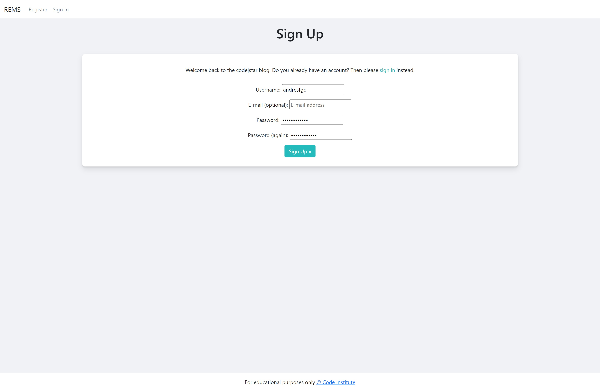
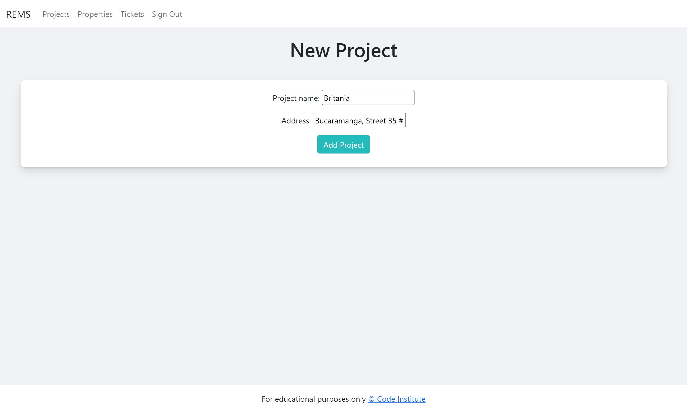
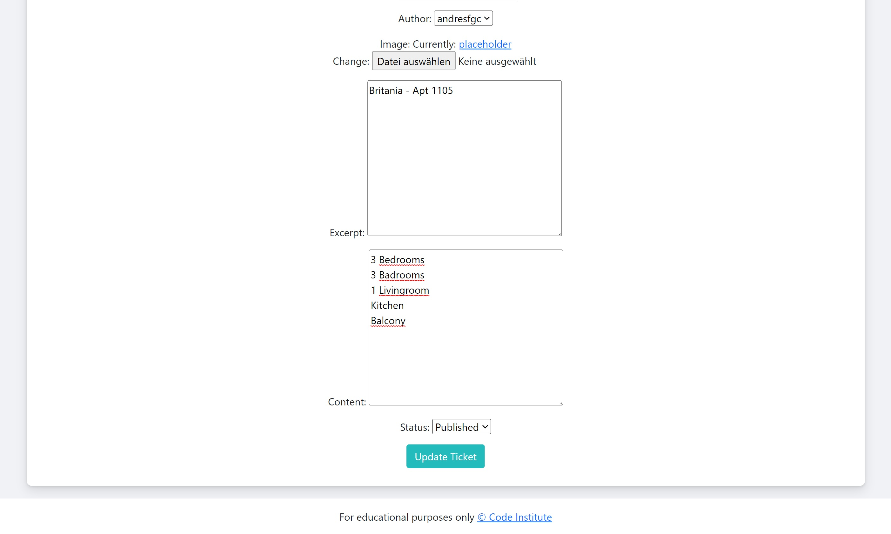
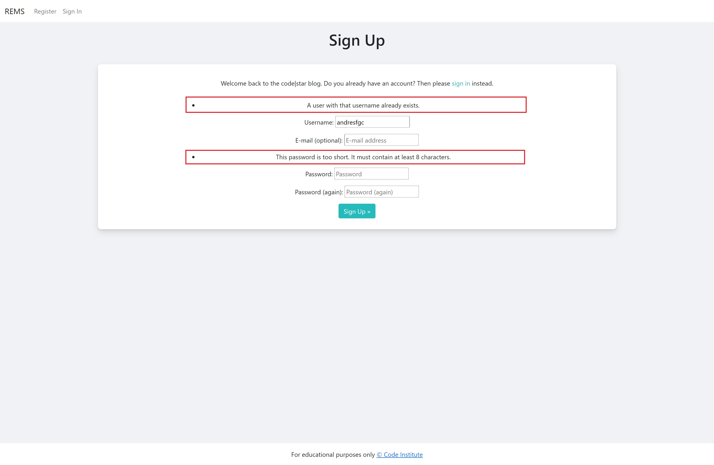
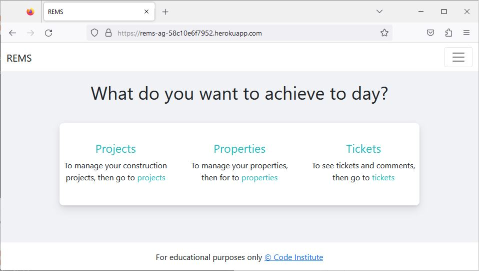

<h1 align="center">REMS - Portfolio Project 4</h1>

REMS is inspired by the sections "Database Management Systems" with its project "Task Manager" and "Full Stack Frameworks" with its project "I think therefore I Blog", together with the personal interest in the area of real estate management, hence the name Real Estate Management System.

REMS is a tool that allows the user to document and share the current status of the properties with his/her team during the sales period. 

In this project it was possible to put into practice fundamental topics such as database creation, agile methodology and CRUD.

Within REMS the user can:

1. create an account and then sign in or out of REMS as many times as he/she wants.
2. create, edit and delete projects at any time he/she wishes.
3. create, edit and delete properties related to the existing project.
4. create, edit, delete and like tickets containing additional information about the current status of the property.
5. document all relevant facts about the property with comments.

The deployed application can be found at [REMS](https://rems-ag-58c10e6f7952.herokuapp.com/)

## Agile Methodology
The project [REMS User Stories](https://github.com/users/andresfgc/projects/7) contains a clear documentation for the five user stories that were developed during the creation of this application. The Backlog has user stories that will solve some of the existing bugs as well as the features left to implement.

## Database Diagram
The entity relationship diagram shows the dependency of the classes on each other and their relationship between the primary and secondary keys.

## UX & Design

### Design

- __Colour Scheme__
  - The three main colours used are white, grey and light-blue.

- __Typography__
  - the "Native font stack" from Bootstrap was used for the typography.

- __Imagery__
  - The Building Placeholder image is integrated to emphasize the idea of using the application as a Real Estate Management System.

### Wireframes

- __Desktop__

- __Mobile__

### User Stories

User Stories are docummented inside the **REMS User Stories Project**

* USER STORY: Sign Up, Sign In & Sign Out
  * As a Site User/Site Admin I can create an account so that my team can see who creates and comments tickets.
  * Accepante Criteria:
    * Enable to Sign Up
    * Enable to Sign In
    * Enable to Sign Out

* USER STORY: CRUD for Projects
  * As a Site User/Site Admin I can manage projects so that the project information can be reviewed and updated in real time.
  * Accepante Criteria:
    * Enable the display of all projects
    * Enable the creation of projects
    * Enable editing the name and address of each project
    * Enable deleting projects

* USER STORY: CRUD for Properties
  * As a Site User/Site Admin I can manage properties so that the property´s information can be reviewed and updated in real time.
  * Accepante Criteria:
    * Enable the display of all properties
    * Enable the creation of properties
    * Enable editing the property name, price, status and related project
    * Enable deleting properties

* USER STORY: CRUD for Tickets
  * As a Site User/Site Admin I can manage tickets so that the ticket's information can be reviewed and updated in real time.
  * Accepante Criteria:
    * Enable the display of all tickets
    * Enable the creation of one ticket for each property
    * Enable editing property, title, slug, author, image, excerpt, content & status for each ticket
    * Enable deleting tickets

* USER STORY: Comment & Like a ticket
  * As a Site User/Site Admin I can comment a ticket so that the team can document all related activities for each property.
  * Accepante Criteria:
    * Enable commenting any ticket
    * Enable adding many comments for the same ticket
    * Enable reading the author, date, time of each ticket and comment
    * Enable seeing likes
    * Enable adding & removing ticket´s likes

### Flowchart

#### Sign Up-In-Out

#### Projects

#### Properties

#### Tickets

#### Comments & Likes

## Features

* Main Page
  * The main page offers a short description of the program along with the option to create an account or if the user has already registered, then he/she has the option to sign in.
  * If the user clicks the **Sign Up** button or the **Register** button on the top left he/she will be sent to the corresponding page where he/she will have to enter the name, email(optional) and password. If the user doesn't enter the minimum required data, the program will display a text where it will let the user know what he/she has to change in order to create the account and enter the platform.
  * If the user clicks the **Sing In** button, he will be forwarded to the corresponding page where he will have to give his username and password, with the possibility of being remembered for future logins.
  * Once the registration button is clicked and the data is correct or user has signed in, the user will be redirected again to the main page, will get a green notification on the top center **Successfully signed in as USERNAME** (notification will disappear after 3 seconds) and he/she can now see a navigation bar on the top left (Projects, Properties Ticekts and Sing Out) and in the center he/she can read a short description about the project-, property- & ticket pages with their corresponding links.
  * If the user wants to come back to the main page (Index) during his/her interaction, he/she can click the **REMS** top-left.
  * If the user wants to signout he/she will frist have to click on the **Sign Out** button on the top-left. Then he/she will be forwarded to the Sign Out page where user will be asked again if he/she really wants to signout. Once user clicks again the **Sign Out** button he/she will be redirected to the main page where user can signin or register a new account and he/she will no longer be able to see the projects, properties and tickets pages on the navigation bar.

* Projects Page
  * The projects page allows the user to view, edit and delete projects.
  * If the user has not created any project the program will display a text inside the table indicating that it is empty.
  * When the user clicks on the "Add a Project" button, he/she will be redirected to the **add_project** page where he/she can enter the name and address.
  * Once the fields are filled in and the "Add Project" button is clicked, the user will be redirected back to the projects page where his/her newly created project will be displayed inside the table.
  * On the right side of each project, the user has the option to edit or delete it. If the user clicks on the "edit" button the **edit_project** page will open. Once the user clicks on the update button, the user will be redirected back to the projects page where he/she will see the updated project data. If the user clicks the "delete" button the page will reload and the project will disappear.

* Properties Page
  * The properties page allows the user to view the created properties, edit them or delete them.
  * If the user has not created any property, the program will show a text indicating that the property table is empty and that before creating a property he/she has to create a project.
  * When the user clicks on the "add a property" button, he/she will be redirected to the **add_property** page where he/she can type the proeprty number, price, status (available, quoted, reserved, rejected, sold) and related project.
  * Once the fields are filled in and the "add property" button is clicked the user will be redirected back to the properties page where he/she will be able to see the newly created property in the table.
  * On the right side of each property the user has the option to edit or delete it. If the user clicks on the "edit" button the **edit_property** page will open. Once the user clicks on the update button, the user will be redirected back to the properties page where he/she will see the updated property data. If the user clicks on the "delete" button the page will reload and the property will disappear.

* Tickets Page
  * The tickets page allows the user to view the created tickets, edit them or delete them.
  * The user will have to create first a project and then a property to finally be able to create a ticket.
  * When the user clicks on the "add a Ticket" button, he/she will be redirected to the **add_ticket** page where he/she can type the related property, title, slug, author, image, excerpt, content and status (Draft or Published).
  * Once the fields are filled in and the "add Ticket" button is clicked the user will be redirected back to the tickets page where he/she will be able to see the newly created ticket in the table.
  * Beloww each ticket the user has the option to edit or delete it. If the user clicks on the "edit" button the **edit_ticket** page will open. Once the user clicks on the update button, the user will be redirected back to the tickets page where he/she will see the updated ticket data. If the user clicks on the "delete" button the page will reload and the ticket will disappear.

* Ticket Details Page
  * The ticket details page allows the user to view the ticket description and comments, add new comments and give or remove the like.
  * To like or unlike is as simple as clicking on the heart at the top left below the description. Right next to it the user can also see the number of comments that have been made within the ticket.
  * The user can write his/her comment in the bottom right corner and add it to the ticket by clicking on the "submit" button. The comment will appear at the bottom left side of the screen, with the name and date of the user who created it.

### Features left to implement

#### For Sign Up-In-Out
* Restrict access without signing in:
  * I plan to add a rule that allow access to projects, properties and tickets pages only for signed in users.

* Single Sign On function:
  * I plan to add a SSO function with Google, Microsoft or social media accounts.

#### For Projects page
* Redirect to project's relevant properties:
  * I plan to give the user the option to be redirected to the project's relevant properties by clicking the name of the project.

* Filter function:
  * I plan to create a filter-function where the user can see only the projects that are currently relevant at a given time.

* Deadline:
  * I plan to add the deadline by which the project is to be sold.

* Message for visual feedback:
  * I plan to add a message function to give feedback to the user when somethin inside the project is not filled correctly. 

#### For Properties page
* Filter-function:
  * I plan to add a filter-function where the user can select only relevant project's properties and another filter-function for the properties's status.

* Message for visual feedback:
  * I plan to add a message function to give feedback to the user when somethin inside the property is not filled correctly. 

#### For Tickets page
* Remove already selected properties:
  * I plan to remove properties that already have a ticket from the drop-down menu at the top of the add_ticket page.

* Auto-complete function for slug:
  * I plan to add an auto-complete function for the slug when using the user interface and not just the administrator interface. Right now the user has to right the correct amount to scores between each space inside the title otherwise the program wont save the ticket.

* Auto-complete function for author:
  * I plan to add an auto-complete function for the Author field without needing to click the drop-down menu.

* Overview for draft-tickets:
  * I plan to add an overview inside the tickets page for tickets that are still drafts. Right now only admin users inside the admin interface can see, edit and delete them.

* Message for visual feedback:
  * I plan to add a message function to give feedback to the user when somethin inside the ticket is not filled correctly. 

#### For Ticket Details page
* CRUD for comments:
  * I plan to add the CRUD functionality for comments, where user can also edit or delete them.

* Like to comments:
  * I plan to add a like option for comments.

* Reply to specific comments:
  * I plan to add the function of replying to a specific comments when needed.

* Get Notificacions:
  * I plan to add a notifications function for every new comment posted.

### Technologies Used

  * Python
    * Most of the program was written in python.
  * Django
    * It's libraries were used to create the application.
  * Github
    * It was used to store the project.
  * Gitpod
    * It was used to create, add, commit and push my code to Github.
  * Heroku
    * It was used to deploy the project.
  * Bootstrap
    * It was used to add css style.
  * gunicorn
    * It is used to run Django on Heroku.
  * JavaScript
    * It is used to close the authentication alert message after 3 seconds.
  
  

### Imported libraries

  * dj_database_url & psycopg2 were used to work with PostgreSQL.
  * dj3-cloudinary-storage was used to store the "building_placeholder" image.
  * summernote was used to add an easy text-edition in admin panel.
  * allauth was used to add authentication.
  * crispy was used to create the comment form.

## Testing

I have manually tested this project by doing the following:
* Passed the code through a [PEP8 linter](https://pep8ci.herokuapp.com/) and confirmed there are no problems, except from line 128 in settings.py where the AUTH_PASSWORD_VALIDATORS is still longer than 79 characters (83 characters).
* Tested in my local terminal and the Code Institute Heroku terminal.
* HTML, no errors were returned when passing through the official [W3C Validator](https://validator.w3.org/nu/?doc=https%3A%2F%2Frems-ag-58c10e6f7952.herokuapp.com%2F).
* CSS, no errors were returned when passing through the official [Jigsaw Validator](https://jigsaw.w3.org/css-validator/validator?uri=https%3A%2F%2Frems-ag-58c10e6f7952.herokuapp.com%2F&profile=css3svg&usermedium=all&warning=1&vextwarning=&lang=es).
* JS, no errors were returned when passing through the official [jshint](https://jshint.com/).

### Bugs

Solved Bugs
* When deleting a project, the properties corresponding to that project were not deleted. Whitin the property model, the variable project was added, which with this option **on_delete=models.CASCADE** deletes all the properties related to the project. The same method was used in the tickets once the corresponding property was deleted.
* The view of the tables in projects and properties pages wasn't responsive enough on mobile devices. CCS was added to make it responsive for most mobiles devices, for the smallest screens you wont be able to see the edit and delete botton completely but it is possible to move the oveview to the left in order to see them fully.

Remaining Bugs
* User can't save the ticket if the slug is not written correctly. Example, for House 22J user has to write "House-22J".
* User can access to the projects, properties, tickets pages without using authentification, but only using the corresponding URLs. This will break the application in some cases like for example when adding a comment without euthentification.
* Event if user uploads a new image, it is still not possible to change the image in the ticket.
* In settings.py, line 128 is longer than 79 characters(4 characters longer). The original 127 was much longer, but it was splitted between line 127 & 128. Hovewer line 128 is still too long, after trying a new line before and after a point, trying a new line before and after "_" and trying a separation with "\", it was decided to add the issue inside a git commit and spcify it again in the README documentation.

### Validator Testing

* PEP8
  * No errors were returned from CI Python Linter

* W3C Validator
  * No HTML errors were returned from W3C Validator

* Jigsaw Validator
  * No CSS errors were returned from Jigsaw Validator

* Jshint
  * No JavaScript errors were returned from Jshint Validator 

### User Stories Testing
| User Goal | Requirement met | Image(s) |
| --------- | --------------- | -------- |
| As a Site User/Site Admin, I can use authentication so that my team can see who creates and comments tickets. | Yes |       |
| As a Site User/Site Admin, I can manage properties so that the property´s information can be reviewed and updated in real time. | Yes |     |
| As a Site User/Site Admin, I can manage properties so that the property´s information can be reviewed and updated in real time. | Yes |     |
| As a Site User/Site Admin, I can manage tickets so that the ticket's information can be reviewed and updated in real time. | Yes |     |
| As a Site User/Site Admin, I can comment a ticket so that the team can document all related activities for each property. | Yes |   |

### Program Validation Testing
| Section Tested | Input To Validate | Expected Outcome | Actual Outcome | Pass/Fail |
| -------------- | ----------------- | ---------------- | -------------- | --------- |
| All Pages |  |  |  |  |
|  | Click on REMS | Redirects user to Main Page  | As expected | PASS |
|  | Click on Projects | Redirects user to Projects Page  | As expected | PASS |
|  | Click on Properties | Redirects user to Properties Page  | As expected | PASS |
|  | Click on Tickets | Redirects user to Tickets Page  | As expected | PASS |
|  | Click on Sign Out button | Redirects user to Sign Out page | As expected | PASS |
| Main Page |  |  |  |  |
|  | Click on Sign Up or Register | Redirects user to Sign Up Page  | As expected | PASS |
|  | Click on Sign In | Redirects user to Sign In Page  | As expected | PASS |
|  | Click on Projects | Redirects user to Projects Page  | As expected | PASS |
|  | Click on Properties | Redirects user to Properties Page  | As expected | PASS |
|  | Click on Tickets | Redirects user to Tickets Page  | As expected | PASS |
| Sign Up |  |  |  |  |
|  | Enter valid username | The field will only accept letters, numbers, and @/./+/-/_ characters  | As expected | PASS |
|  | Enter valid password(twice) | The field will only accept passwords that have at least 8 characters | As expected | PASS |
|  | Click Sign Up button | Redirects user to Main Page (signed in) | As expected | PASS |
| Sign In |  |  |  |  |
|  | Enter valid username | The field will only accept letters, numbers, and @/./+/-/_ characters | As expected | PASS |
|  | Enter valid password | The field will only accept passwords that have at least 8 characters | As expected | PASS |
|  | Click Sign In button | Redirects user to Main Page (signed in) | As expected | PASS |
| Sign Out |  |  |  |  |
|  | Click signout button | Redirects user to main page (signed out) | As expected | PASS |
| Projects Page |  |  |  |  |
|  | Click on add project | Redirects user to add project page | As expected | PASS |
|  | Enter valid Project name | The field will not accept more than 50 characters | As expected | PASS |
|  | Enter valid Address | The field will not accept more than 50 characters | As expected | PASS |
|  | Click on edit project | Redirects user to edit project page | As expected | PASS |
|  | Click on delete project | Removes project and reload page | As expected | PASS |
| Properties Page |  |  |  |  |
|  | Click on add property | Redirects user to add property page | As expected | PASS |
|  | Enter valid Property number | The field will not accept more than 50 characters | As expected | PASS |
|  | Enter valid price | The field will only accept numbers | As expected | PASS |
|  | Enter valid status | The field will only accept the options inside the drop-down menu | As expected | PASS |
|  | Enter valid project | The field will only accept the options inside the drop-down menu | As expected | PASS |
|  | Click on edit property | Redirects user to edit property page | As expected | PASS |
|  | Click on delete property | Removes property and reload page | As expected | PASS |
| Tickets Page |  |  |  |  |
|  | Click on add ticket | Redirects user to add ticket page | As expected | PASS |
|  | Enter valid property | The field will only accept the options inside the drop-down menu | As expected | PASS |
|  | Enter valid title | The field will not accept more than 200 characters | As expected | PASS |
|  | Enter valid slug | The field will not accept more than 200 characters and the hypen symbol (-) instead of spaces | As expected | PASS |
|  | Enter valid author | The field will oly accept the options inside the drop-down menu | As expected | PASS |
|  | Enter Image | The field wont use any image different than the placeholder | As expected | PASS |
|  | Enter Excerpt | The field will accept all kind of text also if it's empty | As expected | PASS |
|  | Enter valid Content | The field will accept all kind of text but it can't be empty | As expected | PASS |
|  | Enter valid author | The field will only accept the options inside the drop-down menu | As expected | PASS |
|  | Click on edit ticket | Redirects user to edit ticket page | As expected | PASS |
|  | Click on delete ticket | Removes ticket and reload page | As expected | PASS |
|  | Click on ticket's title | Redirects user to ticket detail page | As expected | PASS |
| Ticket Detail Page |  |  |  |  |
|  | Enter valid body | The field will accept all kind of text but it can't be empty | As expected | PASS |
|  | Click on submit | Displays the comment with author, date and time on the left and comment's number will increase | As expected | PASS |
|  | Click on heart | The heart (empty) will change color to red and number will increase | As expected | PASS |
|  | Click on read-heart | The heart (liked) will loss it's color and number will decrease | As expected | PASS |

### Cross-browser Testing
I have tested it on Chrome, Firefox and Edge. The program has loaded correctly and had no issues running as expected across all browsers.

| Browser | Image |
| ------- | ----- |
| Chrome |  |
| Firefox |  |
| Edge |  |

## Deployment
This project was deployed using Code Institute's mock terminal for Heroku.

The deployed application can be found at [REMS](https://rems-ag-58c10e6f7952.herokuapp.com/)

* Steps for deployment:
  * Clone template repository
  * Create a new Heroku app
  * Add in Config Vars `CLOUDINARY_URL` with `API Environment variable`, `DATABASE_URL` with `ElephantSQL postgres URL`, `HEROKU_POSTGRESWL_PURPLE_URL` with `postgres URL`, `PORT` with `8000` and `SECRET_KEY` with value
  * Set buildbacks to `Python`
  * Link the Heroku app to the repository in Github
  * Click on Deploy

## Credits

### Code
* Code to add CRUD for projects and properties was taken from Code institute lesson [Database Management Systems > Walkthrough](https://learn.codeinstitute.net/courses/course-v1:CodeInstitute+DB101+2021_T1/courseware/c0c31790fcf540539fd2bd3678b12406/6e44128b0b37416ab40c1a87ef2cb32a/)
* Code to add CRUD for tickets, authentication, comments and likes was taken from Code institute lesson [Full Stack Frameworks > I Think Therefore I Blog](https://learn.codeinstitute.net/courses/course-v1:CodeInstitute+FST101+2021_T1/courseware/b31493372e764469823578613d11036b/fe4299adcd6743328183aab4e7ec5d13/)

### Design
* Wireframes were made using [Wireframe.cc](https://wireframe.cc/)
* Flowchart was made using [Smartdraw](https://www.smartdraw.com/)
* Building placeholder was taken from [Unsplash.com](https://unsplash.com/es/fotos/q7dmr-o4GiM)
