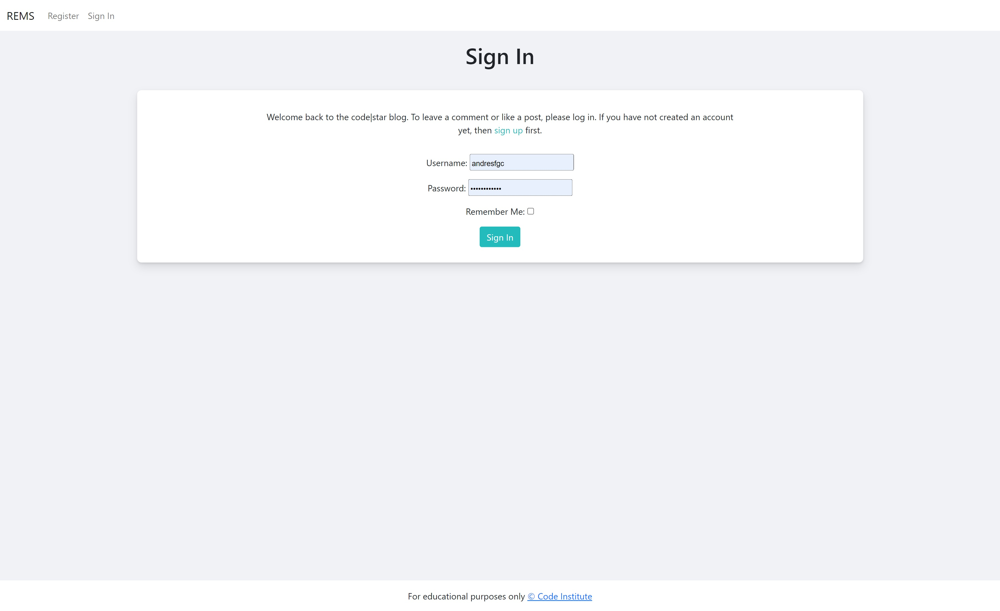

<h1 align="center">REMS - Portfolio Project 4</h1>

REMS is inspired by the sections "Database Management Systems" with its project "Task Manager" and "Full Stack Frameworks" with its project "I think therefore I Blog", together with the personal interest in the area of real estate management, hence the name Real Estate Management System.

REMS is a tool that allows the user to document and share the current status of the properties with his team during the sales period. 

In this project it was possible to put into practice fundamental topics such as database creation, agile methodology and CRUD.

Within REMS the user can:

1. create an account and then sign in or out of REMS as many times as he/she wants.
2. create, edit and delete projects at any time he/she wishes.
3. create, edit and delete properties related to the existing project.
4. create, edit, delete and like tickets containing additional information about the current status of the property.
5. document all relevant facts about the property.

The deployed application can be found at [REMS](https://rems-ag-58c10e6f7952.herokuapp.com/)
## UX & Design

### User Stories

User Stories are docummented inside the **REMS User Stories Project**

* USER STORY: CRUD for Projects
  * As a Site User/Site Admin I can manage projects so that the project information can be reviewed and updated in real time.
  * Accepante Criteria:
    * Enable the display of all projects
    * Enable the creation of projects
    * Enable editing the name and address of each project
    * Enable deleting projects

* USER STORY: CRUD for Properties
  * As a Site User/Site Admin I can manage properties so that the property´s information can be reviewed and updated in real time.
  * Accepante Criteria:
    * Enable the display of all properties
    * Enable the creation of properties
    * Enable editing the property name, price, status and related project
    * Enable deleting properties

* USER STORY: CRUD for Tickets
  * As a Site User/Site Admin I can manage tickets so that the ticket's information can be reviewed and updated in real time.
  * Accepante Criteria:
    * Enable the display of all tickets
    * Enable the creation of one ticket for each property
    * Enable editing property, title, slug, author, image, excerpt, content & status for each ticket
    * Enable deleting tickets

* USER STORY: Comment & Like a ticket
  * As a Site User/Site Admin I can comment a ticket so that the team can document all related activities for each property.
  * Accepante Criteria:
    * Enable commenting any ticket
    * Enable adding many comments for the same ticket
    * Enable reading the author, date, time of each ticket and comment
    * Enable seeing likes
    * Enable adding & removing ticket´s likes

* USER STORY: Sign Up, Sign In & Sign Out
  * As a Site User/Site Admin I can create an account so that my team can see who creates and comments tickets.
  * Accepante Criteria:
    * Enable to Sign Up
    * Enable to Sign In
    * Enable to Sign Out

### Flowchart

#### Main Flowchart

#### Play game

#### Check ranking & quit game

## Features

* Main Page
  * The main page offers a short description of the program along with the option to create an account or if the user has already registered, then he/she has the option to sign in.
  * If the user clicks the **Sign Up** button or the **Register** button on the top left he/she will be sent to the corresponding page where he/she will have to enter the name, email(optional) and password. If the user doesn't enter the minimum required data, the program will display a text where it will let the user know what he/she has to change in order to create the account and enter the platform.
  * If the user clicks the **Sing In** button, he will be forwarded to the corresponding page where he will have to give his username and password, with the possibility of being remembered for future logins.
  * Once the registration button is clicked and the data is correct or user has signed in, the user will be redirected again to the main page, will get a green notification on the top center **Successfully signed in as USERNAME** (notification will disappear after 3 seconds) and he/she can now see a navigation bar on the top left (Projects, Properties Ticekts and Sing Out) and in the center he/she can read a short description about the project-, property- & ticket pages with their corresponding links.
  * If the user wants to come back to the main page (Index) during his/her interaction, he/she can click the **REMS** top-left.
  * If the user wants to signout he/she will frist have to click on the **Sign Out** button on the top-left. Then he/she will be forwarded to the Sign Out page where user will be asked again if he/she really wants to signout. Once user clicks again the **Sign Out** button he/she will be redirected to the main page where user can signin or register a new account and he/she will no longer be able to see the projects, properties and tickets pages on the navigation bar.

* Menu
  * The user will be presented with three options. Number 1 will send the user to start the game, number 2 will present the ranking and number 3 will finish the interaction with the application.
  * The user has the option to end the interaction after giving his/her name, every game played, or checking the ranking.

### Features left to implement
* Restrict access without signing in:
  * I plan to add a rule that allow access to projects, properties and tickets pages only for signed in users.

* Single Sign On function:
  * I plan to add a SSO function with Google, Microsoft or social media accounts.

### Technologies Used

  * Python
    * All program was written in python.
  * Google Sheets
    * It is used to store the raking.
  * Google Cloud
    * It was used to enable the APIs needed.
  * Github
    * It was used to store the project.
  * Gitpod
    * It was used to create, add, commit and push my code to Github.
  * Heroku
    * It was used to deploy the project.

### Imported libraries

  * Random was used to create and place mines inside the board.
  * os was used clear the screen and improve user experience.
  * islice was used to bring only the top ten score for the ranking.
  * gspread was used to connect the program with Google Sheets to bring and update the ranking.

## Testing

I have manually tested this project by doing the following:
* Passed the code through a PEP8 linter and confirmed there are no problems.
* Tested in my local terminal and the Code Institute Heroku terminal.

### Bugs

Solved Bugs
* My "get_name_data" function was accepting all kind of values, I fixed it by adding "isalpha()" inside the if statement.
* My "display_ranking" function was not letting me show the score Value next to the name because it was an integrer and my function was looking for strings to make the ranking tab. I fixed it by converting the top_ten variable again to str before the for loop.
* my "game" function was allowing to write the same coordinate indefinitely to increase the score. I fixed it by adding a list that collects the given coordinates. With the help of this list I was able to use an if statement to check if both the row and the column had already been called before and if yes then re-ask for new coordinates without adding score.

Remaining Bugs
* the ranking does not update names and scores during the same interaction. In case the user makes it into the top 10, he/she must first end the interaction and then start a new one.

### Validator Testing
* PEP8
  * No errors were returned from CI Python Linter
  

### User Stories Testing
| User Goal | Requirement met | Image(s) |
| --------- | --------------- | -------- |
| As a user, I want to be able to type my name and know if the information is valid. | Yes |     |
| As a user, I want to be able to read the rules of the game. | Yes |  |
| As a user, I want to be able to know how many mines are in the minefield. | Yes |  |
| As a user, I want to be able to see the current ranking. | Yes |  |
| As a user, I want to be able to see the given coordinate represented in the minefield. | Yes |  |
| As a user, I want to be able to see the number of mines around the given position. | Yes |  |
| As a user, I want to be able to see what coordinates I have entered during the game. | Yes |  |
| As a user, I want to be able to see my score during and at the end of the game. | Yes |     |
| As a user, I want to be able to know if the coordinates I am entering are valid. | Yes |  |
| As a user, I want to be able to see mines when I lose. | Yes |  |
| As a user, I want to be able to replay the game as many times as I want. | Yes |   |
| As a user, I want to be able to exit the game. | Yes |  |

### Program Validation Testing
| Section Tested | Input To Validate | Expected Outcome | Actual Outcome | Pass/Fail |
| -------------- | ----------------- | ---------------- | -------------- | --------- |
| Start Program | N/A | Load welcome message and prompt user to enter name | As expected | PASS |
| Enter Name | Input "Cami" | Display Menu Option | As expected | PASS |
| Enter Name | Input "1" | Notify user that this isn't a valid input and loop back | As expected | PASS |
| Enter Name | Input "A1" | Notify user that this isn't a valid input and loop back | As expected | PASS |
| Enter Name | Input "Cami garcia" | Notify user that this isn't a valid input and loop back | As expected | PASS |
| Enter Name | Press enter with no input | Notify user that this isn't a valid input and loop back | As expected | PASS |
| Menu Option | Input "1" | Start game | As expected | PASS |
| Menu Option | Input "2" | Display ranking and menu at the bottom | As expected | PASS |
| Menu Option | Input "3" | Say goodbye to user and exit program | As expected | PASS |
| Menu Option | Input "A" | Notify user that this isn't a valid input and loop back | As expected | PASS |
| Menu Option | Input "A1" | Notify user that this isn't a valid input and loop back | As expected | PASS |
| Menu Option | Input "0.1" | Notify user that this isn't a valid input and loop back | As expected | PASS |
| Menu Option | Input "ajc123" | Notify user that this isn't a valid input and loop back | As expected | PASS |
| Menu Option | Input "cami garcia" | Notify user that this isn't a valid input and loop back | As expected | PASS |
| Menu Option | Input "0" | Notify user that this isn't a valid input and loop back | As expected | PASS |
| Menu Option | Input "4" | Notify user that this isn't a valid input and loop back | As expected | PASS |
| Menu Option | Press enter with no input | Notify user that this isn't a valid input and loop back | As expected | PASS |
| Game row or column | Input "1" | Save value to calculate coordinate | As expected | PASS |
| Game row or column | Input "2" | Save value to calculate coordinate | As expected | PASS |
| Game row or column | Input "3" | Save value to calculate coordinate | As expected | PASS |
| Game row or column | Input "4" | Save value to calculate coordinate | As expected | PASS |
| Game row or column | Input "5" | Save value to calculate coordinate | As expected | PASS |
| Game row or column | Input "0" | Notify user that this isn't a valid input and loop back | As expected | PASS |
| Game row or column | Input "6" | Notify user that this isn't a valid input and loop back | As expected | PASS |
| Game row or column | Input "A" | Notify user that this isn't a valid input and loop back | As expected | PASS |
| Game row or column | Input "A1" | Notify user that this isn't a valid input and loop back | As expected | PASS |
| Game row or column | Input "cami garcia" | Notify user that this isn't a valid input and loop back | As expected | PASS |
| Game row or column | Press enter with no input | Notify user that this isn't a valid input and loop back | As expected | PASS |
| Game row or column | input was same as previous coordinates | Notify user that has already given that coordinate and loop back | As expected | PASS |

### Cross-browser Testing
I have tested it on Chrome, Firefox and Edge. The program has loaded correctly and had no issues running as expected across all browsers.

| Browser | Image |
| ------- | ----- |
| Chrome |  |
| Firefox |  |
| Edge |  |

## Deployment
This project was deployed using Code Institute's mock terminal for Heroku.

The deployed application can be found at [minefield](https://minefield.herokuapp.com/)

* Steps for deployment:
  * Clone template repository
  * Create a new Heroku app
  * Add in Config Vars `CREDS` with value and `PORT` with `8000` 
  * Set buildbacks to `Python` and `NodeJS` in that order
  * Link the Heroku app to the repository in Github
  * Click on Deploy

## Credits

### Code
* Code to add mines and display board taken from [Painless Programming](https://www.youtube.com/watch?v=bGr-j89FaRM) and [here](https://www.youtube.com/watch?v=Wjzgm6p0TJY&t=1s)
* Code to clear_screen function taken from [Rahul Janghu](https://www.scaler.com/topics/how-to-clear-screen-in-python/)

### Design
* Flowchart was made using [Smartdraw](https://www.smartdraw.com/)